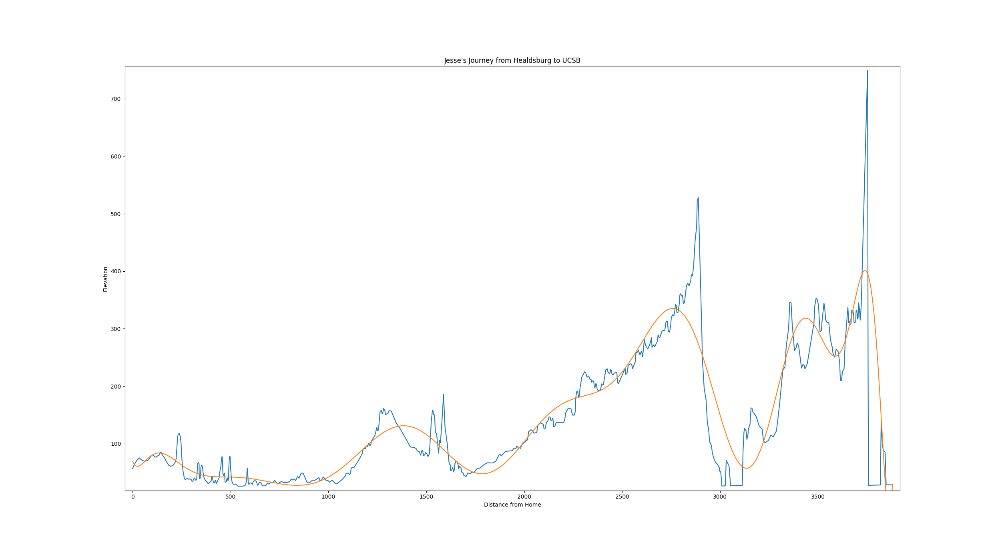

# Jesse's Journey to UCSB

A simple experiment in fitting polynomials to a height map of the journey between Healdsburg CA to UC Santa Barbara.

For example, a 25th order polynomial fit:

$$2.72721*10^{-79}*x^{25} - 7.16588*10^{-75}*x^{24} + 7.4221*10^{-71}*x^{23} - 3.35508*10^{-67}*x^{22} +$$

$$1.33929*10^{-64}*x^{21} + 4.21337*10^{-60}*x^{20} - 6.05487*10^{-57}*x^{19} - 5.68933*10^{-53}*x^{18} +$$

$$1.09182*10^{-49}*x^{17} + 8.06564*10^{-46}*x^{16} - 2.08588*10^{-42}*x^{15} - 1.04226*10^{-38}*x^{14} +$$

$$4.71526*10^{-35}*x^{13} + 5.77332*10^{-32}*x^{12} - 9.26391*10^{-28}*x^{11} + 3.38506*10^{-24}*x^{10} -$$

$$7.21009*10^{-21}*x^{9} + 1.03004*10^{-17}*x^{8} - 1.03118*10^{-14}*x^{7} + 7.29271*10^{-12}*x^{6} -$$

$$3.58449*10^{-09}*x^{5} + 1.1725*10^{-06}*x^{4} - 0.000234184*x^{3} + 0.0239004*x^{2} -$$

$$0.81762*x + 69.3548$$



Notable files:

* [plot.py](plot.py), which contains the python code to calculate the polynomial fit.
* [heightmap.csv](heightmap.csv), which contains the dataset used.

## Getting ready to use:

Install Python from https://www.python.org/downloads/

Then, install the python packages I use with pip, the python package manager:

```bash
$ pip install -r requirements.txt
```

## Running:

Simply run the plot program in python:

```bash
$ python3 plot.py
```

